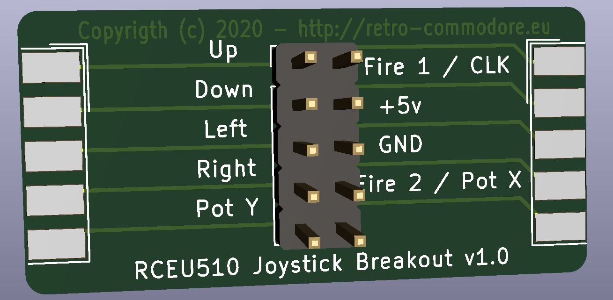

# RCEU510-Joystick-Breakout
 RCEU510 - Joystick breakout for diagnostics or development purposes

# BOM
1x DB9 Male (for wire)
1x DB9 Female (for wire)
1x 2x5 or 2x 1x5 SIL header

# Description
This little adapter can be used to measure signals (i.e. mouse movements) or diagnostics.

